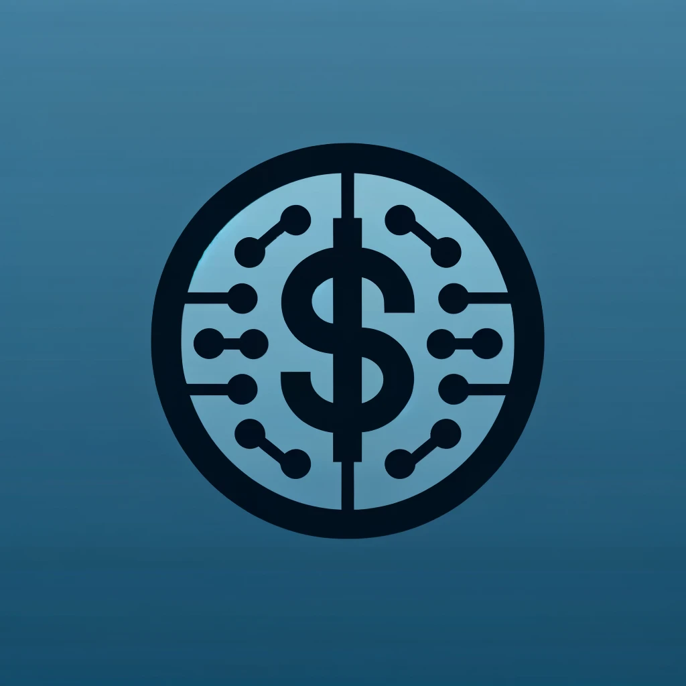

<p align="center">
  
</p>

# Supportbank

Supportbank is a command-line interface (CLI) tool for various finance-related
tasks.

The aim of the project is to give users some useful features, to interact with
financial data stored on the user's computer, and make use of data on a server.

For example,

```bash
node cli convert currency 100 USD GBP
```

will convert currency for them.

## State of the project

Right now, some parts of the project have been written, but it has been
abandoned by the contractor, and there are a number of steps we need to take to
get it working.

Fortunately, the original developer was practising TDD, so there are some tests
to guide us!

## Getting started

1. Make sure your machine is set up according to the instructions with

   - [bash](https://tech-docs.corndel.com/bash/)
   - [vscode](https://tech-docs.corndel.com/vscode/)
   - [git](https://tech-docs.corndel.com/git/)
   - [node & npm](https://tech-docs.corndel.com/js/installation.html)

1. Clone the repository (i.e. download it), so you have a copy on your machine.

> [!NOTE]
>
> Running `npm install` won't work because this project hasn't been fully set up yet!
> That's what we'll be doing in the Day 1 Exercises, so move straight on :arrow_down:

## Exercises

The exercises for each day are in the `docs` folder:

- [Day 1 Exercises](./docs/day-1-exercises.md)

- [Day 2 Exercises](./docs/day-2-exercises.md)

- [Day 3 Exercises](./docs/day-3-exercises.md)

## Workshops

> [!NOTE]
>
> Be sure to read `CONTRIBUTING.md` before getting started on the workshops.

The workshop for each day can also be found in the `docs` folder:

- [Day 1 Workshop](./docs/day-1-workshop.md)

- [Day 2 Workshop](./docs/day-2-workshop.md)

- [Day 3 Workshop](./docs/day-3-workshop.md)
